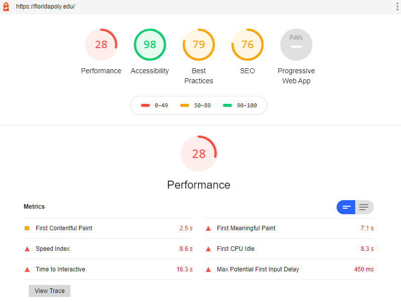

# Rules for Contributing
Below is a list of requirements for any pull request to this repository. These requirements must all be met before submitting a pull request.

1. The main page must remain HTTPS compliant
2. Use of javascript is reserved for only functions that do not contribute to the performance of the critical links or main page.
3. Keep CSS to a minimum.
4. Add links to the index.html, or request a new page or sections to be added.
5. All links must be Florida Polytechnic University related.
6. All scripts on the page must also be https compliant. Do not import scripts from other websites that do not use https.
7. No pop-ups, dropdowns, or unwanted spam without user interaction. There should be no spam created by visiting the index.html page.

# Main Focus
The main focus of this project is to make commonly used links easily accessible to the Florida Polytechnic Community. This website should meet or exceed the performance of the [floridapoly.edu](https://floridapoly.edu/) website concerning:
1. Useability
2. Loading Speed
3. Performance
4. Security
5. Accessibility
